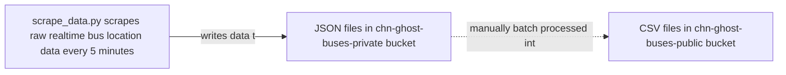

# Ghost Buses Data README

All data scraped as part of this project is originally provided by the CTA and is subject to CTA's terms of use. Realtime data refers to data from the CTA's [bus tracker API's `getvehicles` feed](https://www.transitchicago.com/developers/bustracker/) (which we scrape every 5 minutes) and schedule data refers to data from the [CTA's GTFS feed](https://www.transitchicago.com/developers/gtfs/) (which we do not yet automatically scrape), sometimes collected via the [Transitfeeds archive](https://transitfeeds.com/p/chicago-transit-authority/165) to access versioned feeds. Data collection started the evening of May 19; the first few files on that date are experimental so it's recommended to start analysis on 5/20 when the data is cleaner.

As of 9/5/22, the high-level data flow for the CHN Ghost Buses project is as follows:

## Accessing data in S3 

Data in the public `chn-ghost-buses-public` bucket can be accessed several ways. For example, you can:

* Go directly to the URL for a resource in your browser to download the file locally. URLs follow the form `https://chn-ghost-buses-public.s3.us-east-2.amazonaws.com/{path_to_file_as_described below}`; for example: `https://chn-ghost-buses-public.s3.us-east-2.amazonaws.com/schedule_summaries/route_level/schedule_route_daily_hourly_summary_v20220507.csv`. 

* Use standard request libraries and packages. For example, you can use [wget](https://www.gnu.org/software/wget/manual/) like `wget https://chn-ghost-buses-public.s3.us-east-2.amazonaws.com/schedule_summaries/route_level/schedule_route_daily_hourly_summary_v20220507.csv` (see above for notes on the URL format/construction).

* Use Pandas, which recognizes `s3` file URIs if you install the `s3fs` dependency. So, for example, you can use: `pandas.read_csv('s3://chn-ghost-buses-public/schedule_summaries/route_level/schedule_route_daily_hourly_summary_v20220507.csv')` to load a file as a Pandas dataframe.

## Available data

There are a few types of data available in the public S3 bucket. The **data** listed here is available publicly, even if the notebooks that generate this data cannot be run by users without access to the private S3 bucket. 

* **Daily summaries of the scraped realtime data**: To make the raw API response data more user-friendly for analysis, the [`rt_daily_aggregations`](https://github.com/chihacknight/chn-ghost-buses/blob/main/data_analysis/rt_daily_aggregations.ipynb) notebook aggregates the JSON files into three separate aggregated files. **As of 9/5/22, this notebook cannot be run without access to the private S3 bucket i.e. it is not meant to be run by general users of the data. However, anyone can access the _artifacts_ generated by this notebook which are enumerated here and which are available in the public bucket.**
    * **`bus_full_day_data`**: 
        * These are CSV files that contain all the non-error data we received from the API, concatenated together for a full day. The schema of the data is exactly what is returned from the API, plus a few additional fields documented below; see [CTA documentation](https://www.transitchicago.com/assets/1/6/cta_Bus_Tracker_API_Developer_Guide_and_Documentation_20160929.pdf) for field definitions in the `getvehicles` section. The fields added in the notebook (i.e., not from the original API response) are:
            * `scrape_file`: Name of S3 resource where original JSON response containing this row is saved.
            * `data_time`: The `tmstmp` field from the raw API response converted to a Pandas DateTime object.
            * `data_hour`: The hour extracted from the `data_time` (integer between 0 and 23).
            * `data_date`: The date extracted from the `data_time`.
        * In S3, these are available in the `chn-ghost-buses-public` bucket in a folder called `bus_full_day_data_v2`. Within that folder there is one file per full day from `2022-05-20` until `2022-08-07`, so full filenames are like `bus_full_day_data_v2/2022-05-20.csv`.
    * **`bus_full_day_errors`**: 
        * These are CSV files that contain all the error data we received from the API, concatenated together for a full day. The schema of the data is exactly what is returned from the API, with only a `scrape_file` field added that records the name of the S3 resource where the original JSON response that contained this row is saved; see [CTA documentation](https://www.transitchicago.com/assets/1/6/cta_Bus_Tracker_API_Developer_Guide_and_Documentation_20160929.pdf) for field definitions in the `getvehicles` section. 
        * In S3, these are available in the `chn-ghost-buses-public` bucket in a folder called `bus_full_day_errors_v2`. Within that folder there is one file per full day from `2022-05-20` until `2022-08-07`, so full filenames are like `bus_full_day_errors_v2/2022-05-20.csv`.
    * **`bus_hourly_summaries`**: 
        * These are CSV files that have been aggregated for analysis, with the goal of identifying actual trips that occurred on a given day/hour/route/direction combination (for example, the number of Howard-bound #22 Clark bus trips on May 20th between 3 and 4pm). Their schema is as follows:
            * `data_date`: Date the data was scraped
            * `data_hour`: Hour extracted from data timestamp	
            * `rt`: Route (from original API response; see API documentation)	
            * `des`: Direction (from original API response; see API documentation)	
            * `vid`: A set containing the unique `vid` values observed during the given data hour on the given `rt` with the given `des` value (`vid` values come from original API response; see API documentation)	
            * `tatripid`: A set containing the unique `tatripid` values observed during the given data hour on the given `rt` with the given `des` value (`tatripid` values come from original API response; see API documentation)
            * `tablockid`: A set containing the unique `tablockid` values observed during the given data hour on the given `rt` with the given `des` value (`tablockid` values come from original API response; see API documentation)
            * `vh_count`: Length of `vid` set (i.e., count of unique `vid` values encountered during this data hour on the given `rt` with the given `des` value)
            * `trip_count`: Length of `tatripid` set (i.e., count of unique `tatripid` values encountered during this data hour on the given `rt` with the given `des` value)
            * `block_count`: Length of `tablockid` set (i.e., count of unique `tablockid` values encountered during this data hour on the given `rt` with the given `des` value)
        * In S3, these are available in the `chn-ghost-buses-public` bucket in a folder called `bus_hourly_summary_v2`. Within that folder there is one file per full day from `2022-05-20` until `2022-08-07`, so full filenames are like `bus_hourly_summary_v2/2022-05-20.csv`.
* **schedule_summaries**: To compare the realtime data with the schedule, [`static_gtfs_analysis.ipynb`](https://github.com/chihacknight/chn-ghost-buses/blob/main/data_analysis/static_gtfs_analysis.ipynb) ingests a GTFS schedule file and outputs a file that aggregates to a count of unique trips per hour on a given route. There are two flavors:
    * `route_level`: 
        * These files do not distinguish between different route directions/destinations (so Howard-bound #22 Clark bus trips are combined with Harrison-bound #22 Clark bus trips). Their schema is:
            * `date`: Schedule date (can be joined with `bus_hourly_summaries.data_date`)
            * `route_id`: Route identifier (can be joined with `bus_hourly_summaries.rt`)
            * `hour`: Schedule hour (can be joined with `bus_hourly_summaries.data_hour`)
            * `trip_count`: Count of unique trip IDs scheduled to have any scheduled stops within the given hour on the given route (can be compared with `bus_hourly_summaries.trip_count`)
        * In S3, these are available in the `chn-ghost-buses-public` bucket in a folder called `schedule_summaries`. Within that folder there is one file per published GTFS feed version from `2022-05-07` to `2022-07-18`. A list of feed versions is available on [Transit.Land](https://www.transit.land/feeds/f-dp3-cta). The full filepaths are like: `schedule_summaries/route_level/schedule_route_daily_hourly_summary_v20220507.csv`.
    * `route_dir_level`: These files are identical to the `route_level` except that they include a `direction` field, from the original GTFS data. **These `direction` fields are cardinal directions like `East` and  `West` and therefore do not map directly to the realtime data's `des` field**. TODO: We can probably use trip headsign or another field to get something more useful for comparison. 
* **schedule_rt_comparisons**: 
    * These files are generated by [compare_scheduled_and_rt.ipynb](https://github.com/chihacknight/chn-ghost-buses/blob/main/data_analysis/compare_scheduled_and_rt.ipynb) and represent a comparison of the realtime `bus_hourly_summaries` files with the `schedule_summaries` files. Their schema is: 
        * `route_id`: Route identifier, from GTFS schedule 
        * `day_type`: A short code identifying day type: holiday (`hol`), weekday (`wk `), Saturday (`sat`), or Sunday (`sun`)
        * `trip_count_rt`: Total realtime trips identified for this route + day type -- TODO: currently this total is calculated by summing the hourly totals; this could be improved (but the method is the same for scheduled and realtime, so it is apples-to-apples)
        * `trip_count_sched`: Total scheduled trips for this route + day type -- TODO: currently this total is calculated by summing the hourly totals; this could be improved (but the method is the same for scheduled and realtime, so it is apples-to-apples)
        * `ratio`: `trip_count_rt` / `trip_count_sched`
    * In S3, these are available in the `chn-ghost-buses-public` bucket in a folder called `schedule_rt_comparisons`. Within that folder there is one file per published GTFS feed version from `2022-05-07` to `2022-07-18`. A list of feed versions is available on [Transit.Land](https://www.transit.land/feeds/f-dp3-cta). The full S3 filepaths are like: `schedule_rt_comparisons/route_level/schedule_v20220507_realtime_rt_level_comparison_2022-05-20_to_2022-06-02.csv`. An overall combined file is available at: `schedule_rt_comparisons/route_level/combined_schedule_realtime_rt_level_comparison_2022-05-20_to_2022-07-20.csv`.