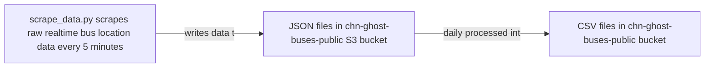

# Ghost Buses Data README

All data scraped as part of this project is originally provided by the CTA and is subject to CTA's terms of use. Realtime data refers to data from the CTA's [bus tracker API's `getvehicles` feed](https://www.transitchicago.com/developers/bustracker/) (which we scrape every 5 minutes) and schedule data refers to data from the [CTA's GTFS feed](https://www.transitchicago.com/developers/gtfs/) (which we do not yet automatically scrape), sometimes collected via the [Transitfeeds archive](https://transitfeeds.com/p/chicago-transit-authority/165) to access historical / prior versioned feeds. Data collection started the evening of May 19; the first few files on that date are experimental so it's recommended to start analysis on 5/20 when the data is cleaner.

As of 10/15/22, the high-level data flow for the CHN Ghost Buses project is as follows:

## Accessing data in S3 

Data in the public `chn-ghost-buses-public` bucket is publicly accessible for reading, but only @lauriemerrell can currently write data to it.

The data can be accessed several ways. To access an individual file, you can:

* Go directly to the URL for a resource in your browser to download the file locally. URLs follow the form `https://chn-ghost-buses-public.s3.us-east-2.amazonaws.com/{path_to_specific_file_as_described below}`; for example: `https://chn-ghost-buses-public.s3.us-east-2.amazonaws.com/bus_full_day_data_v2/2022-10-01.csv`. 

* Use standard request libraries and packages. For example, you can use [wget](https://www.gnu.org/software/wget/manual/) like `wget https://chn-ghost-buses-public.s3.us-east-2.amazonaws.com/bus_full_day_data_v2/2022-10-01.csv` (see above for notes on the URL format/construction).

* Use Pandas, which recognizes `s3` file URIs if you install the `s3fs` dependency. So, for example, you can use: `pandas.read_csv('s3://chn-ghost-buses-public/bus_full_day_data_v2/2022-10-01.csv')` to load a file as a Pandas dataframe. *Note: Some members of the breakout group have experienced challenges accessing the data in this way; you can also use a full URL as described in the first bullet to load data into Pandas like: `pandas.read_csv(https://chn-ghost-buses-public.s3.us-east-2.amazonaws.com/bus_full_day_data_v2/2022-10-01.csv)`.*

## Available data

There are a few types of data available in the public S3 bucket. The **data** listed here is available publicly. Ability to run notebooks and scripts in the repo may vary depending on the age or maintenance state of the notebook or script, but you should be able to access the **data** in S3 even if you cannot run some of the notebooks and scripts. 

* **Daily scraped realtime data**: To make the raw API response data more user-friendly for analysis, we save daily-level CSV files that contain all the data that we got back from the API in a given day. (The raw data is in hundreds of JSON files per day; these CSVs combine all the data for a single day into one file so you can request a specific date more easily.) The data is split into two types of files: `data` (valid bus location information) and `errors` (most commonly cases where we requested information for a route and there are no active trips on that route at the time of the request.)
    * **Data**
        * These are CSV files that contain all the non-error data we received from the API, concatenated together for a full day. The schema of the data is exactly what is returned from the API, plus a few additional fields documented below; see [the `getvehicles` section of the CTA documentation](https://www.transitchicago.com/assets/1/6/cta_Bus_Tracker_API_Developer_Guide_and_Documentation_20160929.pdf) for field definitions from the API. The fields that we have added (i.e., not from the original API response) are:
            * `scrape_file`: Name of S3 resource where original JSON response containing this row is saved.
            * `data_time`: The `tmstmp` field from the raw API response converted to a Pandas DateTime object.
            * `data_hour`: The hour extracted from the `data_time` (integer between 0 and 23).
            * `data_date`: The date extracted from the `data_time`.
        * These files are generated daily between 10 and 11am Central for the prior day. There is one file per full day from `2022-05-20` until the day before you are making the request. So, if you are checking on `2022-10-02` after 11am Central, data will be available up to and including `2022-10-01`.
        * In S3, these are available in the `chn-ghost-buses-public` bucket in a folder called `bus_full_day_data_v2`. Full filenames are like `bus_full_day_data_v2/{date in YYYY-MM-DD format}.csv`. So, to load the data for `2022-10-01` in Pandas, you could do: `pandas.read_csv(https://chn-ghost-buses-public.s3.us-east-2.amazonaws.com/bus_full_day_data_v2/2022-10-01.csv)`.
    * **Errors**: 
        * These are CSV files that contain all the error data we received from the API, concatenated together for a full day. The schema of the data is exactly what is returned from the API, with only a `scrape_file` field (see above) added that records the name of the S3 resource where the original JSON response that contained this row is saved; see [the `getvehicles` section of the CTA documentation](https://www.transitchicago.com/assets/1/6/cta_Bus_Tracker_API_Developer_Guide_and_Documentation_20160929.pdf) for field definitions from the API.
        * These files are generated daily between 10 and 11am Central for the prior day. There is one file per full day from `2022-05-20` until the day before you are making the request. So, if you are checking on `2022-10-02` after 11am Central, errors will be available up to and including `2022-10-01`.
        * In S3, these are available in the `chn-ghost-buses-public` bucket in a folder called `bus_full_day_errors_v2`. Full filenames are like `bus_full_day_errors_v2/{date in YYYY-MM-DD format}.csv`. So, to load the data for `2022-10-01` in Pandas, you could do: `pandas.read_csv(https://chn-ghost-buses-public.s3.us-east-2.amazonaws.com/bus_full_day_errors_v2/2022-10-01.csv)`.

